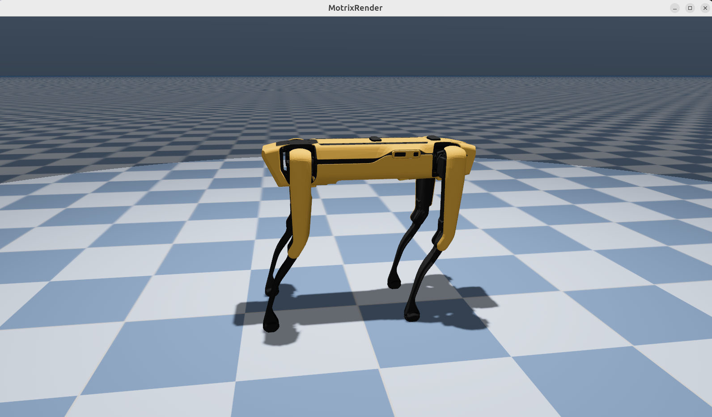

# 🚀 Quick Start: Hello MotrixSim



This tutorial demonstrates a simple example—loading the Spot quadruped robot and running a physics simulation—to introduce the core steps and basic concepts for creating simulation experiments in MotrixSim:

```{literalinclude} ../../../../examples/hello_motrixsim.py
:language: python
:dedent:
:start-after: "# tag::start"
:end-before:  "# tag::end"
```

That's the complete code! With just 10 lines, you accomplish all the essential steps for a MotrixSim simulation experiment.

You can now start exploring MotrixSim, or continue reading below for a detailed explanation of each step:

## Load the Model

```python
model = mx.load_model("examples/assets/boston_dynamics_spot/scene.xml")
```

First, we call [`load_model`] to load a model file, which includes both physical and rendering data (see [`SceneModel`] for details).
MotrixSim supports multiple model formats, including MJCF and URDF (OpenUSD is under development). Here, we use the MJCF format for the Go1 quadruped robot model, which you can find at [examples/assets/boston_dynamics_spot/scene.xml].
You can also use [`load_mjcf_str`] to load a model directly from an MJCF string; see [examples/load_from_str.py] for an example.

## Launch the Renderer

```python
render = mx.render.RenderApp()
```

Next, we create a renderer instance [`RenderApp`], which is responsible for visualizing the model.

## Load the Model into the Renderer

```python
render.launch(model)
```

The renderer needs to load the model data before rendering. We call [`render.launch(model)`] to start the renderer and load the model.

## Create Physics Data (SceneData)

```python
data = mx.SceneData(model)
```

Physical simulation requires a data structure to store the model's state. We use [`SceneData`] to create a physics data object associated with the model. This can be considered an instance of the model, and you can create multiple instances from the same model.

## Physics Simulation

```python
mx.step(model, data)
```

The core of the simulation is the [`step`] function, which updates the model's state. Each call performs a single simulation time step.
In this example, we call [`step`] 1000 times in a loop, pausing for 2 milliseconds between each call (the default time step for the go1 model) to simulate the passage of time.

## Synchronize the Renderer

```python
render.sync(data)
```

After each simulation step, we need to synchronize the model state with the renderer to update the visualization. We call [`sync`] to perform this operation.

```{note}
The call frequency between [`step`] and [`sync`] does not have to be 1:1. You can adjust the frequency as needed for your application.
```

With this, the entire example is complete. You can now try modifying parameters to observe the physical effects under different settings.

## Next Steps

-   See [mjcf](mjcf.md) for supported features
-   Learn how to use the [main features](../main_function/scene_model.md)
-   Explore more [example programs](../overview/examples.md)

[`load_model`]: motrixsim.load_model
[`SceneModel`]: ../main_function/scene_model.md
[`load_mjcf_str`]: motrixsim.load_mjcf_str
[examples/assets/boston_dynamics_spot/scene.xml]: ../../../../examples/assets/boston_dynamics_spot/scene.xml
[examples/load_from_str.py]: ../../../../examples/load_from_str.py
[`RenderApp`]: ../main_function/render.md
[`render.launch(model)`]: motrixsim.render.RenderApp.launch
[`SceneData`]: ../main_function/scene_model.md
[`step`]: motrixsim.step
[`sync`]: motrixsim.render.RenderApp.sync
